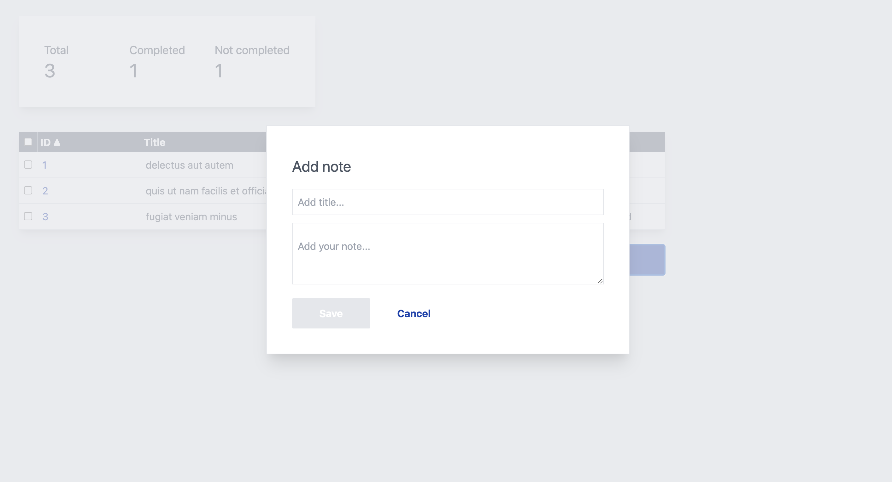

# note-app
A simple web app that allows to delete and save notes.

Build using: 
- Vue
- Jest for testing
- Tailwind as CSS framework
- MirageJS for mock server

## Screenshots of the app 




## Project setup
```
npm install
```

### Compiles and hot-reloads for development
```
npm run serve
```

### Compiles and minifies for production
```
npm run build
```

